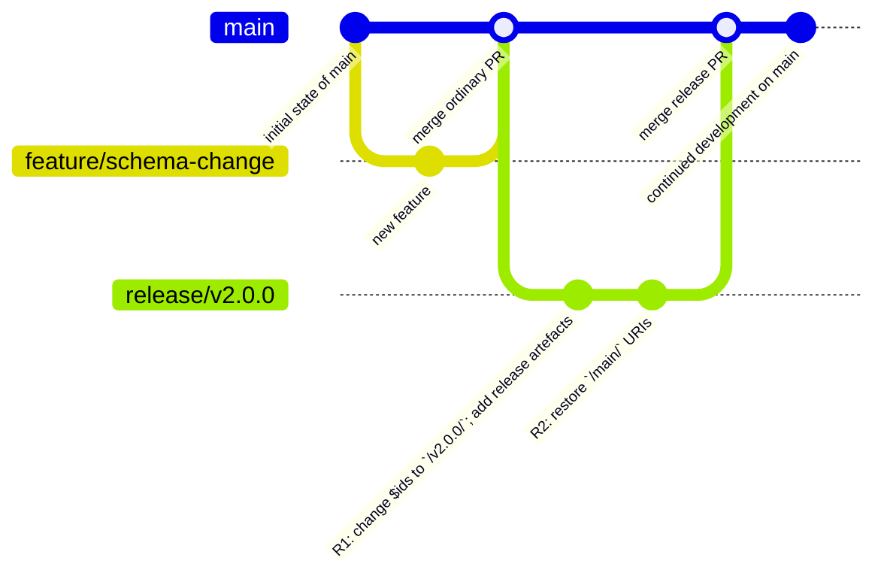

# Release process

This guide describes the repository-discovered, PR-derived release process for maintainers and contributors. The protected `main` branch is the development source. A reviewed two-commit candidate proves the exact bytes that a maintainer later publishes under an immutable SemVer tag.

## Process at a glance

Maintainers provide exactly three release inputs: 
1. Structured `## Release notes` and exceptional `## Compatibility review` sections in ordinary PR bodies.
2. Top-level `meta:version` in each changed component schema.
3. A bundle version supplied when [**Prepare release**](../../.github/workflows/prepare_release.yml) is dispatched. 

The manifest, changelog entry, citation version, URI rewrites, checksums, dependencies, and reports are generated and asserted.

## Branch, tag, and URI model

| Ref or record | Meaning | First-party raw URI segment |
|---|---|---|
| `main` | Protected development branch; new work continues here. | `/main/` |
| `release/vX.Y.Z` | Generated candidate branch containing exactly two commits (R1 and R2). | R1 uses `/vX.Y.Z/`; R2 uses `/main/`. |
| R1 | First candidate commit and exact future tag snapshot. | `/vX.Y.Z/` |
| R2 | Second candidate commit, restoring development URIs without changing release records. | `/main/` |
| `vX.Y.Z` | Immutable tag created only after the release PR is merged and publication is manually dispatched. | `/vX.Y.Z/` |

R1 contains the generated manifest, changelog entry, citation version, component versions, dependencies, URI rewrites, and immutable checksums. R2 is reconstructed from R1 and is required to be byte-for-byte deterministic (i.e., no extra or missing edits). The release PR must be merged with a merge commit so R1 remains addressable.

## Git history example

The tag (e.g., `v2.0.0`) placeholder is created at R1, with its exact tag-URI snapshot in the graph below. The _real_ tag (taking R1 commit) is created only after R2 restores `/main/` URIs, the release PR is merged, and a maintainer manually dispatches publication.



## End-to-end process

The diagram uses yellow 🟡 for maintainer actions, blue 🔵 for automation, purple 🟣 for decisions, neutral grey ⚪ for repository state, indigo 🔷 for generated artefacts, green 🟢 for a completed release, and red 🔴 for recovery. Happy-path arrows are animated.

```mermaid
flowchart TB
    subgraph DEV["1. Ordinary development PR"]
        d1(["<b>Maintainer edits</b> PR notes, schema content and <code>meta:version</code>"]):::maintainer
        d2["Modular CI: Python, compatibility, contexts, coverage, frames, examples, SHACL, notes and policy"]:::automation
        d3{"All required checks pass?"}:::decision
        d4["Correct the ordinary PR"]:::failure
        d5(["<b>Maintainer merges</b> the ordinary PR into <code>main</code>"]):::maintainer
        d6[("<code>main</code> is release-ready")]:::state
        d1 dev_1@--> d2
        d2 dev_2@--> d3
        d3 -- "No" --> d4 -. retry .-> d1
        d3 dev_4@-- "Yes" --> d5
        d5 dev_3@--> d6
        dev_1@{ animate: true, animation: slow }
        dev_2@{ animate: true, animation: slow }
        dev_3@{ animate: true, animation: slow }
        dev_4@{ animate: true, animation: slow }
    end
    subgraph PREP["2. Preparation and local tag-snapshot proof"]
        p1(["<b>Maintainer chooses</b> bundle SemVer and dispatches <b>Prepare release</b>"]):::maintainer
        p2["Collect merged PR notes and discover components, dependencies and standards"]:::automation
        p3["Assert requested SemVer and calculated lower bounds"]:::automation
        p4["Generate changelog, manifest and citation; rewrite repository URIs"]:::automation
        p5["Create R1 exact tag snapshot, then deterministic R2 <code>/main/</code> normalisation"]:::automation
        p6["Locally verify R1 tag bytes and URI/ref consistency"]:::automation
        p7[("<code>release/vX.Y.Z</code> with R1 then R2")]:::artifact
        p1 prep_1@--> p2
        p2 prep_2@--> p3
        p3 prep_3@--> p4
        p4 prep_4@--> p5
        p5 prep_5@--> p6
        p6 prep_6@--> p7
        prep_1@{ animate: true, animation: slow }
        prep_2@{ animate: true, animation: slow }
        prep_3@{ animate: true, animation: slow }
        prep_4@{ animate: true, animation: slow }
        prep_5@{ animate: true, animation: slow }
        prep_6@{ animate: true, animation: slow }
        p3 -. "Failure" .-> d4
    end
    subgraph REVIEW["3. Maintainer release-PR review and merge"]
        r1["Release consistency CI checks exactly two commits, R1 and reproducible R2"]:::automation
        r2(["<b>Maintainer creates, reviews and approves</b> release PR to <code>main</code>"]):::maintainer
        r3{"Checks green and review complete?"}:::decision
        r4["Leave candidate closed; fix <code>main</code> in an ordinary PR"]:::failure
        r5(["<b>Maintainer merges</b> release PR with a merge commit"]):::maintainer
        r6[("Merged release PR keeps R1 addressable")]:::state
        p7 review_1@--> r2
        r2 review_2@--> r1
        r1 review_3@--> r3
        r3 -- "No" --> r4 -. new candidate .-> p1
        r3 review_5@-- "Yes" --> r5
        r5 review_4@--> r6
        review_1@{ animate: true, animation: slow }
        review_2@{ animate: true, animation: slow }
        review_3@{ animate: true, animation: slow }
        review_4@{ animate: true, animation: slow }
        review_5@{ animate: true, animation: slow }
    end
    subgraph PUB["4. Manual publication and remote proof"]
        u1(["<b>Maintainer dispatches</b> <b>Publish release</b> with merged PR number and optional confirmation"]):::maintainer
        u2["Resolve immutable R1 from merged PR; prove repository, base, merge and two-commit shape"]:::automation
        u3["Re-prove R1 and reproducible R2; build archive, manifest and SHA256SUMS"]:::automation
        u4{"Pre-tag checks pass?"}:::decision
        u5["Stop before tag; inspect logs and correct <code>main</code> in an ordinary PR"]:::failure
        u6[("Create immutable tag at R1; never force-move or delete it")]:::artifact
        u7["Create draft GitHub Release, upload assets, verify remote tag/archive/checksums/citation"]:::automation
        u8{"Remote proof passes?"}:::decision
        u9["After tag: stop for maintainer inspection; do not mutate the tag"]:::failure
        u10[("Publish normal or prerelease GitHub Release")]:::success
        r6 publish_1@--> u1
        u1 publish_2@--> u2
        u2 publish_3@--> u3
        u3 publish_4@--> u4
        u4 -- "No" --> u5 -. new candidate .-> p1
        u4 publish_7@-- "Yes" --> u6
        u6 publish_5@--> u7
        u7 publish_6@--> u8
        u8 -- "No" --> u9
        u8 publish_8@-- "Yes" --> u10
        publish_1@{ animate: true, animation: slow }
        publish_2@{ animate: true, animation: slow }
        publish_3@{ animate: true, animation: slow }
        publish_4@{ animate: true, animation: slow }
        publish_5@{ animate: true, animation: slow }
        publish_6@{ animate: true, animation: slow }
        publish_7@{ animate: true, animation: slow }
        publish_8@{ animate: true, animation: slow }
    end
    subgraph DONE["5. Durable release and continued development"]
        z1[("Consumers use <code>/vX.Y.Z/</code> resources")]:::state
        z2[("Development continues on <code>main</code> with <code>/main/</code>")]:::state
        u10 done_1@--> z1
        r6 done_2@--> z2
        done_1@{ animate: true, animation: slow }
        done_2@{ animate: true, animation: slow }
    end
    d6 phase_1@--> p1
    phase_1@{ animate: true, animation: slow }
    classDef maintainer fill:#FFF4CC,stroke:#B7791F,color:#4A2A00,stroke-width:2px;
    classDef automation fill:#E6F3FF,stroke:#2563EB,color:#102A43,stroke-width:1.5px;
    classDef decision fill:#F3E8FF,stroke:#7C3AED,color:#3B0764,stroke-width:2px;
    classDef state fill:#F8FAFC,stroke:#475569,color:#0F172A,stroke-width:1.5px;
    classDef artifact fill:#EEF2FF,stroke:#4F46E5,color:#1E1B4B,stroke-width:2px;
    classDef failure fill:#FEECEC,stroke:#DC2626,color:#7F1D1D,stroke-width:1.5px;
    classDef success fill:#DCFCE7,stroke:#15803D,color:#14532D,stroke-width:3px;
    style DEV fill:#FFFFFF,stroke:#CBD5E1,stroke-width:1px
    style PREP fill:#FFFFFF,stroke:#CBD5E1,stroke-width:1px
    style REVIEW fill:#FFFFFF,stroke:#CBD5E1,stroke-width:1px
    style PUB fill:#FFFFFF,stroke:#CBD5E1,stroke-width:1px
    style DONE fill:#FFFFFF,stroke:#CBD5E1,stroke-width:1px
```



## Maintained inputs and generated records

Maintainer(s) only need to supply the three inputs [above](#process-at-a-glance). The release process generates and asserts the rest, as follows.

The **release manifest** is an immutable inventory of the bundle: repository and source metadata, every active component with its schema version, identity, dependencies, schema/context/frame checksums, and one deterministic checksum per immediate standards group such as Beacon or Bioschemas. It does **not** record removed components, descriptions, or previous versions: absence in a newer inventory establishes removal, while PR and changelog history explains it.

Repository identity comes from an explicit argument, GitHub's `${{ github.repository }}`, or Git origin. First-party `$id`, `$ref`, context and frame URLs are rewritten for the repository performing the release, including forks and renamed repositories. This helps other developers or groups (e.g., FEGA nodes) to fork the repository, and not need to edit the upstream-owner configuration file or code, as the information is inferred.

## Version and compatibility policy

Bundle versions are strict SemVer, including prereleases such as `2.0.0-draft.1`. A declared bundle version may exceed the calculated minimum (e.g., `v2.3.0` when `v2.2.1` was enough), never fall below it. Component versions cover each schema and its sibling context/frame as one unit.

Compatibility is an accepted-input lower bound, not proof that all data remains semantically compatible. Major changes can invalidate previously valid input; minor changes expand accepted input; patch changes preserve validation behaviour. Composition, `$ref`, pattern/format, context or frame changes may be `unknown`. For a removed property declaration, removal from an explicitly closed object (e.g., `"additionalProperties": false`) is breaking/major, removal from a default-open object is non-breaking/minor, and ambiguous composition or schema-valued closure is unknown. 

Without an applicable rationale, `unknown` requires a major bump. A concrete rationale from a PR that changed the component or a reachable dependency permits a reviewed lower bump but still requires at least a version change. Examples do not prove compatibility.

The first intended published test release is the genuine prerelease `v1.0.0-draft.1`.

## Local commands and CI gates

Run commands from the repository root with the pinned environment. The CLIs below are implemented and are useful for focused checks.

**Discover components** in the repository:

```console
python3 scripts/py/release.py discover -v
```

Analyze **semantic versioning for schema changes**. The first form compares two explicit JSON files and is the debugging example for an isolated change:

```console
python3 scripts/py/release.py semver path/to/before.schema.json path/to/after.schema.json -v
```

Select one discovered component with `--component`, or report all components with `--all`. Supply the prior tag (or branch name) with `--previous-ref` for analysis:

```console
python3 scripts/py/release.py semver --component process --previous-ref v1.2.3 -v
python3 scripts/py/release.py semver --all --previous-ref v1.2.3 -v
```

**Collect pull request metadata** for release notes generation:

```console
python3 scripts/py/release_notes.py collect --repository OWNER/REPOSITORY --previous-ref v1.2.3 --source-sha COMMIT_SHA --output prs.json -v
```

**Generate changelog entries**. Use `--dry-run` to preview output without writing:

```console
python3 scripts/py/release_notes.py changelog --bundle-version 2.0.0-draft.1 --release-date 2026-08-06 --prs-json prs.json --dry-run -v
```

Start from scratch (i.e., bootstrap) with a new changelog file:

```console
python3 scripts/py/release_notes.py bootstrap-changelog --bundle-version 2.0.0-draft.1 --release-date 2026-08-06 --output /tmp/CHANGELOG.next.md
```

**Generate a release manifest** with `--dry-run` to preview:

```console
python3 scripts/py/release.py manifest --bundle-version 2.0.0-draft.1 --source-commit COMMIT_SHA --dry-run -o manifest.json
```

**Verify schema and release** configuration in development mode:

```console
python3 scripts/py/release.py verify --mode development -v
```

The release-notes CLI also provides `validate-pr`, `render`, and `collect`; inspect `--help` for their required inputs before using them.

The independent required status checks are **Python tests**, **Schema compatibility**, **Schema examples**, **JSON-LD contexts**, **JSON-LD coverage**, **JSON-LD frames**, **RDF SHACL**, **PR release notes**, **Release policy**, and **Release consistency**. Release policy protects generated records on ordinary PRs; release consistency proves R1/R2 on `release/v…` PRs and reports not-applicable otherwise.

Validation workflows can also be **started manually** from GitHub Actions (e.g., click on [`Run workflow`](https://github.com/EGA-archive/fega-metadata-schema/actions/workflows/schema_examples.yml)), so you can run these checks on different branches. `merge_group` ensures that required checks are reported for GitHub's temporary merge-queue commit as well as for the original pull request.

## Human maintainer runbook

### 1. Before opening an ordinary PR

1. Edit the schema, sibling context/frame, examples or documentation as required.
2. Update top-level `meta:version` in each affected component schema. Do **not** edit generated manifests, changelog release sections, citation version or URI snapshots.
3. Fill the PR template's strict `## Release notes` section. When compatibility is `unknown`, add a concrete `## Compatibility review` rationale.
4. Run a focused check such as:
````
python3 scripts/py/release.py discover -v
python3 scripts/py/release.py verify --mode development -v
````

> [!IMPORTANT]
> This is a maintainer gate: do not request review until the release-note section and every affected `meta:version` are accurate.

### 2. Review and merge the ordinary PR

1. Inspect the outcome of [schema_compatibility.yml](../../.github/workflows/schema_compatibility.yml): compatibility report, its lower-bound bump, any `unknown` rationale, and all independent required status checks.
2. Correct failures in the ordinary PR and rerun checks. Do not edit the automated generated artifacts (e.g., [`release_manifest.json`](../../build/release_manifest.json)) by hand.
3. Merge manually into protected `main` (squash merge is acceptable for ordinary PRs).

> [!IMPORTANT]
> This is a maintainer gate: merge only after every required check is green and the review confirms the declared versions and compatibility decision.

### 3. Confirm readiness and choose a bundle version

1. Confirm `main` contains the intended merged PRs and no unfinished release candidate.
2. Choose a strict SemVer bundle version greater than the previous release and no lower than the calculated minimum.

> [!IMPORTANT]
> This is a maintainer gate: the bundle version is supplied by the maintainer and is never inferred or silently bumped by automation.

### 4. Preview release inputs locally

In ``main``, use the commands in the [previous section](#local-commands-and-ci-gates) to inspect discovered components, compare a before/after schema, analyse all components against a previous ref, preview changelog output from collected PR JSON, generate a dry-run manifest, and verify development mode. The changelog command requires `--release-date` and `--prs-json`. Obtain PR JSON with the implemented `release_notes.py collect` command when GitHub access is available.

> [!CAUTION]
> If analysis or a dry run fails, fix the underlying ordinary PR or metadata and merge a correction into `main`. Never hand-edit generated R1/R2 files.

### 5. Dispatch 'Prepare release'

1. Open **Actions → Prepare release → Run workflow** on `main`.
2. Enter the bundle SemVer (e.g., `v2.0.0-draft.1`) and dispatch.
3. Inspect the run summary for the candidate branch, tag, R1 and R2, and inspect every failure log.

The workflow validates SemVer, confirms branch/tag names are unused, verifies development mode, discovers the previous tag or bootstrap path, generates records, proves R1 locally, creates exactly two commits, verifies R2 and pushes `release/vX.Y.Z` without force. On the first release it promotes the existing `[Unreleased]` text into the chosen bundle version; a later no-change promotion from that prerelease to its matching stable version receives a generated promotion entry.

> [!IMPORTANT]
> This is a maintainer gate: do not proceed until the preparation summary names the intended branch and both commit IDs and the run is successful.

> [!CAUTION]
> If preparation fails before a tag exists, leave any candidate branch or PR closed, fix `main` in an ordinary PR, and dispatch a new candidate. Do not hand-edit generated records or reuse a failed candidate branch.

### 6. Create the release PR

1. Open the preparation summary's compare URL, or choose **New pull request** with base `main` and head `release/vX.Y.Z`.
2. Create the PR manually: automation does not create, approve, merge or delete it. Replace the template's release-note fields with the non-public form below so this mechanical release PR is accounted for but does not become a changelog entry in the next bundle.
```markdown
## Release notes

Category: None

## Compatibility review

Not applicable
```
3. Confirm the PR contains exactly R1 followed by R2 and that **Release consistency** runs.

> [!IMPORTANT]
> This is a maintainer gate: the release PR must target `main`, must retain both generated commits, and must be reviewed as a release candidate rather than edited.

### 7. Review and merge the release PR

Review R1's tag-form bytes, R2's `/main/` normalisation, component versions, generated changelog and citation, repository identity, grouped standards checksums, dependencies, and every independent status check. Confirm the release PR's source commit is the intended `main` base and that no generated file was changed manually.

> [!IMPORTANT]
> This is a maintainer gate: approve and merge the generated release PR with a merge commit so immutable R1 remains addressable; do not squash it.

> [!CAUTION]
> If review or CI fails before publication, leave or close the candidate, correct `main` in an ordinary PR, and prepare a new two-commit candidate. Do not patch R1 or R2 manually.

### 8. Dispatch 'Publish release'

1. Open **Actions → Publish release → Run workflow** on the repository's default branch.
2. Enter the merged release pull-request number and, optionally, the expected tag (e.g., `v2.0.0-draft.1`).
3. Read the run summary and logs through the irreversible boundary: publication resolves the merged PR, proves its exact two-commit shape, verifies R1, builds assets, and only then creates the tag without force.

> [!IMPORTANT]
> This is a maintainer gate and an irreversible boundary: confirm the merged PR number, repository, base branch, version and R1 before dispatch. After tag creation, never delete, retag or force-move it.

### 9. Verify the durable release

After publication, inspect the immutable tag and GitHub Release, including the prerelease flag for a tag containing `-`, manifest and citation versions, component and standards checksums, raw `/vX.Y.Z/` resources, source ZIP, `SHA256SUMS`, and any uploaded attestations. The workflow itself runs `scripts/py/verify_remote_release.py` before publishing.

```console
gh release view v2.0.0-draft.1 --json tagName,isDraft,isPrerelease,assets,url
git ls-remote --tags origin refs/tags/v2.0.0-draft.1
python3 scripts/py/verify_remote_release.py --tag v2.0.0-draft.1 --repository OWNER/REPOSITORY --manifest build/release_manifest.json
```

> [!CAUTION]
> If a failure occurs after the tag exists, stop and inspect the exact tag, draft/released state, assets, checksums and citation. Resume only when tooling proves the existing tag points to expected R1; never delete, retag or force-move automatically.

### 10. Continue development

Consumers use immutable `/vX.Y.Z/` resources while new work continues on `main` with `/main/` references. Deleting the merged `release/vX.Y.Z` branch manually through GitHub is optional. Never force-delete it from automation.

## Failure recovery and audit trail

Before a tag exists, the safe recovery is always an ordinary corrective PR to `main` followed by a new preparation dispatch. Generated R1/R2 commits, manifests, changelog sections, citations, URI snapshots and component inventories should never be hand-edited.

Track progress live in individual Actions runs, logs and artefacts, ordinary PR bodies and reviews, the preparation summary, the release PR and its two immutable commits, generated changelog and manifest, merged PR metadata, immutable tag, GitHub Release state and assets, remote verification output, and attestations when present. Together these records provide a retrospective audit trail from maintainer input through published bytes.
